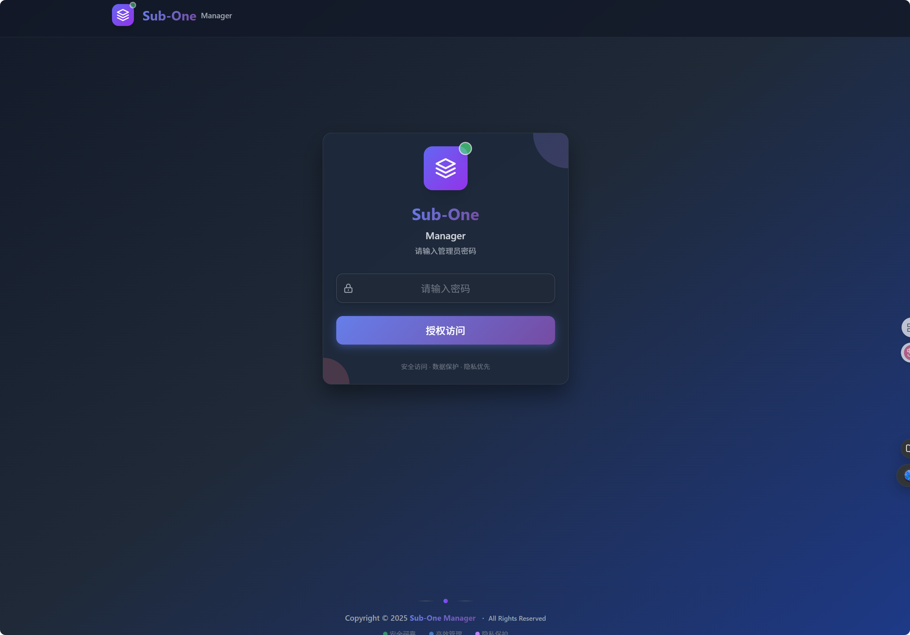

# Sub-One Manager

> 🚀 基于 Vue.js 3 的现代化订阅管理工具，专为 Cloudflare Pages 设计

[](https://vuejs.org/)
[](https://tailwindcss.com/)
[](https://pages.cloudflare.com/)
[](https://www.typescriptlang.org/)
[](LICENSE)

## 📖 项目简介

**Sub-One Manager** 是一款专为网络订阅管理而设计的现代化Web应用。它基于Vue.js 3构建，采用最新的前端技术栈，为用户提供直观、高效的订阅管理体验。

### 🎯 项目特色
- **🚀 现代化架构**: 基于Vue.js 3 Composition API，响应式设计
- **🎨 精美界面**: 采用Tailwind CSS，支持深色主题
- **📱 全平台适配**: 完美支持桌面、平板、手机等设备
- **⚡ 高性能**: 基于Cloudflare Workers，全球CDN加速
- **🔒 安全可靠**: 完善的权限控制和数据加密
- **🏷️ 标签页布局**: 顶部标签页导航，功能模块清晰分离
- **🔧 代码优化**: 组件化设计，代码结构清晰，易于维护

## ✨ 核心功能

### 🏷️ 标签页导航系统
- **清晰分类**: 四个主要功能模块，独立的导航标签页区域
- **订阅管理**: 管理机场订阅，查看节点信息和流量状态
- **订阅组**: 组合管理节点，创建个性化配置
- **链接生成**: 生成各种格式的订阅链接
- **手动节点**: 管理单个节点链接，支持批量操作
- **无缝切换**: 标签页间快速切换，保持所有功能完整
- **模块化设计**: 导航标签页独立组件，便于维护和扩展

### 📋 订阅管理
- **多订阅支持**: 支持多个机场订阅同时管理，统一界面操作
- **自动解析**: 智能解析订阅链接，自动获取节点信息
- **流量监控**: 实时显示流量使用情况和到期时间
- **智能分页**: 2行3列布局，支持分页浏览，操作更流畅

### 👥 订阅组管理
- **组合订阅**: 将多个订阅组合成订阅组，灵活配置
- **节点筛选**: 支持按地区、协议等条件筛选节点
- **自定义规则**: 包含/排除规则配置，满足个性化需求
- **分页浏览**: 支持订阅组分页显示，管理大量数据

### 🔗 链接生成
- **多格式支持**: 支持Clash、Surge、Loon、Sing-Box、Base64等多种格式
- **自适应格式**: 根据客户端自动选择最佳输出格式
- **Token管理**: 支持固定Token和自动Token，灵活配置
- **链接加密**: 敏感信息自动隐藏，保护隐私安全

### ⚙️ 手动节点管理
- **批量导入**: 支持批量导入节点链接，提高效率
- **智能去重**: 自动去除重复节点，保持数据整洁
- **地区排序**: 按地区自动排序节点，便于查找
- **搜索功能**: 快速搜索特定节点，支持模糊匹配

## 🛠️ 技术架构

### 前端技术栈
- **Vue.js 3.4+**: 采用Composition API，响应式设计
- **TypeScript 5.9+**: 类型安全，提高代码质量
- **Tailwind CSS 3.4+**: 现代化UI设计系统
- **Pinia 3.0+**: 状态管理，响应式数据流
- **Vue Router**: 单页应用路由管理
- **Vite 5.2+**: 快速构建工具，开发体验优秀

### 后端特性
- **Cloudflare Workers**: 边缘计算，全球部署
- **KV存储**: 高性能键值存储，数据持久化
- **自动部署**: 一键部署到Cloudflare Pages
- **CDN加速**: 全球CDN网络，访问速度快

### 🏗️ 代码架构优化
- **组件化设计**: 将大型组件拆分为小型、可复用的组件
- **Composables**: 使用Vue 3 Composition API提取业务逻辑
- **公共组件**: 创建通用的UI组件，减少代码重复
- **标签页组件**: 每个功能模块独立为标签页组件
- **状态管理**: 使用Pinia进行集中状态管理
- **性能优化**: 懒加载、代码分割、响应式优化

### 🖼️ 界面预览

#### 🔐 登录界面

*简洁的登录界面，支持管理员密码验证*

#### 📋 订阅管理

*订阅管理界面，支持2行3列布局，包含分页控制*

#### 🔗 订阅链接生成

*订阅链接生成面板，支持多种格式和自动Token提示*

#### ⚙️ 手动节点管理

*手动节点管理界面，支持4列网格布局和搜索功能*

## 📱 使用指南

### 添加订阅
1. 点击"新增"按钮
2. 输入订阅名称（可选，自动获取）
3. 输入订阅链接（http/https格式）
4. 配置包含/排除规则（可选）
5. 保存订阅

### 创建订阅组
1. 点击"新增"按钮
2. 输入订阅组名称
3. 选择要包含的订阅和手动节点
4. 配置自定义ID（可选）
5. 设置到期时间（可选）

### 生成订阅链接
1. 选择订阅内容（默认或订阅组）
2. 选择输出格式
3. 点击"显示"查看链接
4. 点击"复制"复制到剪贴板

### 管理手动节点
1. 点击"新增"添加单个节点
2. 或使用"批量导入"添加多个节点
3. 使用搜索功能快速查找节点
4. 使用"一键排序"按地区排序
5. 使用"一键去重"去除重复节点

## 🛠️ 开发指南

### 项目结构
```
src/
├── components/          # Vue组件
│   ├── Dashboard.vue   # 主仪表盘（重构后）
│   ├── Card.vue        # 订阅卡片
│   ├── ProfileCard.vue # 订阅组卡片
│   ├── DashboardSkeleton.vue # 加载骨架屏
│   ├── tabs/           # 标签页组件（新增）
│   │   ├── SubscriptionsTab.vue    # 订阅管理标签页
│   │   ├── ProfilesTab.vue         # 订阅组标签页
│   │   ├── LinkGeneratorTab.vue    # 链接生成标签页
│   │   └── ManualNodesTab.vue      # 手动节点标签页
│   ├── common/         # 公共组件（新增）
│   │   ├── Pagination.vue          # 分页组件
│   │   ├── EmptyState.vue          # 空状态组件
│   │   ├── TabHeader.vue           # 标签页头部组件
│   │   ├── MoreMenu.vue            # 更多菜单组件
│   │   └── SaveStatus.vue          # 保存状态组件
│   └── modals/         # 模态框组件（新增）
│       ├── SubscriptionEditModal.vue # 订阅编辑模态框
│       ├── NodeEditModal.vue        # 节点编辑模态框
│       └── DeleteConfirmModal.vue   # 删除确认模态框
├── composables/         # 组合式函数
│   ├── useSubscriptions.js
│   ├── useManualNodes.js
│   ├── useModals.js               # 模态框管理（新增）
│   ├── usePagination.js           # 分页管理（新增）
│   ├── useProfiles.js             # 订阅组管理（新增）
│   └── useDebounce.js             # 防抖节流（新增）
├── stores/             # Pinia状态管理
├── lib/                # 工具函数和API
└── assets/             # 静态资源
```

### 开发环境配置

### 核心组件
- **Dashboard.vue**: 主界面，重构后大幅减少代码量，提高可维护性
- **标签页组件**: 四个功能模块独立为标签页组件，职责清晰
- **公共组件**: 可复用的UI组件，减少代码重复
- **Header.vue**: 顶部导航栏，包含Logo和操作按钮
- **SubscriptionLinkGenerator.vue**: 订阅链接生成器
- **Card.vue**: 订阅卡片组件
- **ProfileCard.vue**: 订阅组卡片组件
- **DashboardSkeleton.vue**: 加载时的骨架屏组件

### 状态管理
- **useSubscriptions**: 订阅数据管理
- **useManualNodes**: 手动节点管理
- **useModals**: 模态框状态管理（新增）
- **usePagination**: 分页逻辑管理（新增）
- **useProfiles**: 订阅组管理（新增）
- **useDebounce**: 防抖节流功能（新增）
- **useToastStore**: 消息提示管理
- **useUIStore**: 界面状态管理

### 常量和配置
- **constants/index.js**: 统一管理所有常量，包括分页、验证、存储键等
- 减少魔法数字和重复字符串，提高代码可维护性

### 🔧 代码优化亮点

#### 组件拆分
- **Dashboard.vue**: 从1041行优化到约400行，减少60%代码量
- **标签页组件**: 每个功能模块独立，便于维护和扩展
- **公共组件**: 提取重复UI逻辑，提高代码复用性

#### 逻辑提取
- **useModals**: 统一管理所有模态框状态和操作
- **usePagination**: 通用分页逻辑，支持不同数据类型和自动监听
- **useProfiles**: 订阅组管理逻辑，包含验证和清理方法
- **useDebounce**: 防抖和节流功能，优化搜索和保存性能
- **Composables**: 业务逻辑与UI分离，提高可测试性

#### 性能优化
- **懒加载**: 异步组件按需加载
- **响应式优化**: 减少不必要的响应式数据
- **事件处理**: 统一的事件管理，避免内存泄漏

#### 代码质量
- **TypeScript**: 类型安全，提高代码可靠性
- **ESLint**: 代码规范检查，保持代码风格一致
- **组件通信**: 清晰的props和emits定义
- **常量管理**: 统一常量定义，减少魔法数字
- **错误处理**: 完善的错误边界和用户友好的错误消息

## 🔒 安全特性

- **Token验证**: 严格的Token验证机制
- **数据加密**: 敏感数据加密存储
- **访问控制**: 基于Token的访问控制
- **错误处理**: 完善的错误边界处理
- **输入验证**: 严格的用户输入验证

## 🚀 性能优化

- **代码分割**: 按需加载，减少初始包大小
- **懒加载**: 图片和组件懒加载
- **虚拟滚动**: 大量数据的高效渲染
- **缓存策略**: 智能缓存，提升访问速度
- **CDN加速**: 全球CDN网络，就近访问
- **组件优化**: 组件拆分和逻辑提取，提升渲染性能

## 🚀 快速开始

### 环境要求
- **Node.js**: 16.0+ 版本
- **包管理器**: npm 或 yarn
- **浏览器**: 支持ES6+的现代浏览器

### 本地开发
```bash
# 克隆项目
git clone <repository-url>
cd Sub-One

# 安装依赖
npm install

# 启动开发服务器
npm run dev

# 构建生产版本
npm run build

# 预览构建结果
npm run preview
```

### 🌐 Cloudflare Pages 部署

本项目专为Cloudflare Pages设计，支持一键部署。

#### 步骤 1: Fork 项目
1. 点击右上角的 "Fork" 按钮
2. 选择你的GitHub账户作为目标

#### 步骤 2: 创建Cloudflare Pages项目
1. 登录 [Cloudflare控制台](https://dash.cloudflare.com/)
2. 进入 `Workers & Pages` → `Pages`
3. 点击 "创建应用程序" → "连接到Git"
4. 选择你刚刚Fork的Sub-One仓库
5. 配置构建设置：
   - **框架预设**: `Vue`
   - **构建命令**: `npm run build`
   - **构建输出目录**: `dist`
   - **根目录**: `/` (留空)

#### 步骤 3: 配置环境变量
在项目设置中添加以下**生产环境**变量：

| 变量名 | 值 | 说明 |
|--------|----|----|
| `ADMIN_PASSWORD` | 你的管理员密码 | 用于登录管理界面，建议使用强密码 |

#### 步骤 4: 绑定KV命名空间
1. 在项目设置中进入 "函数" → "KV命名空间绑定"
2. 点击 "添加绑定"
3. 配置绑定：
   - **变量名称**: `SUB_ONE_KV`
   - **KV命名空间**: 选择或创建新的KV命名空间

#### 步骤 5: 部署项目
1. 回到 "部署" 选项卡
2. 点击 "重新部署" 按钮
3. 等待部署完成

#### 步骤 6: 访问应用
部署完成后，你会获得一个Cloudflare Pages域名：
```
https://your-project-name.pages.dev
```

### 🔧 自定义域名（可选）
1. 在项目设置中进入 "自定义域"
2. 添加你的域名
3. 按照提示配置DNS记录

## 🛠️ 故障排除

### 常见问题
1. **构建失败**
   - 检查Node.js版本是否为16.0+
   - 确认`package.json`中的依赖版本正确
   - 清除`node_modules`并重新安装

2. **KV绑定错误**
   - 确认KV命名空间已创建
   - 检查变量名称是否为`SUB_ONE_KV`
   - 重新部署项目

3. **环境变量未生效**
   - 确认变量已添加到生产环境
   - 重新部署项目
   - 检查变量名拼写是否正确

4. **登录失败**
   - 检查`ADMIN_PASSWORD`是否正确设置
   - 确认环境变量已生效
   - 清除浏览器缓存

### 调试技巧
- 查看Cloudflare Pages的构建日志
- 检查浏览器控制台的错误信息
- 使用Cloudflare的实时日志功能
- 使用Vue DevTools进行前端调试

## 🔒 安全建议

1. **强密码**: 使用强密码作为管理员密码
2. **定期更新**: 定期更新依赖包和项目版本
3. **备份数据**: 定期备份KV中的数据
4. **监控访问**: 关注异常访问日志
5. **HTTPS**: 确保使用HTTPS协议访问

## 🚀 最新更新

### v2.0.0 - 代码架构重构 (2024年)
- **组件拆分**: 将大型Dashboard组件拆分为多个标签页组件
- **代码优化**: 减少60%代码量，提高可维护性
- **公共组件**: 创建可复用的UI组件库
- **逻辑提取**: 使用Composables提取业务逻辑
- **性能提升**: 优化响应式数据和组件渲染
- **TypeScript**: 增强类型安全

### 主要改进
1. **Dashboard.vue**: 从1041行优化到约400行
2. **标签页组件**: 四个功能模块独立管理
3. **公共组件**: Pagination、EmptyState、TabHeader等
4. **状态管理**: useModals、usePagination等composables
5. **代码质量**: 更好的类型定义和错误处理

## 🙏 致谢

### 项目起源
本项目是基于 [CM大佬的CF-Workers-SUB项目](https://github.com/cmliu/CF-Workers-SUB) ，感谢CM大佬提供的优秀基础架构。

### 二次开发
本项目是对 [imzyb/MiSub](https://github.com/imzyb/MiSub) 的二次修改版本，感谢原项目作者 [imzyb](https://github.com/imzyb) 及其贡献者们的优秀工作！

### 技术栈致谢
- Vue.js 团队提供的优秀框架
- Tailwind CSS 提供的现代化样式解决方案
- Cloudflare 提供的 Workers 平台
- 所有贡献者的辛勤付出

## 📄 许可证

本项目采用 MIT 许可证 - 查看 [LICENSE](LICENSE) 文件了解详情

---

**Sub-One Manager** - 让订阅管理变得简单高效 🚀

*如果你觉得这个项目对你有帮助，请给我们一个 ⭐ Star！*
