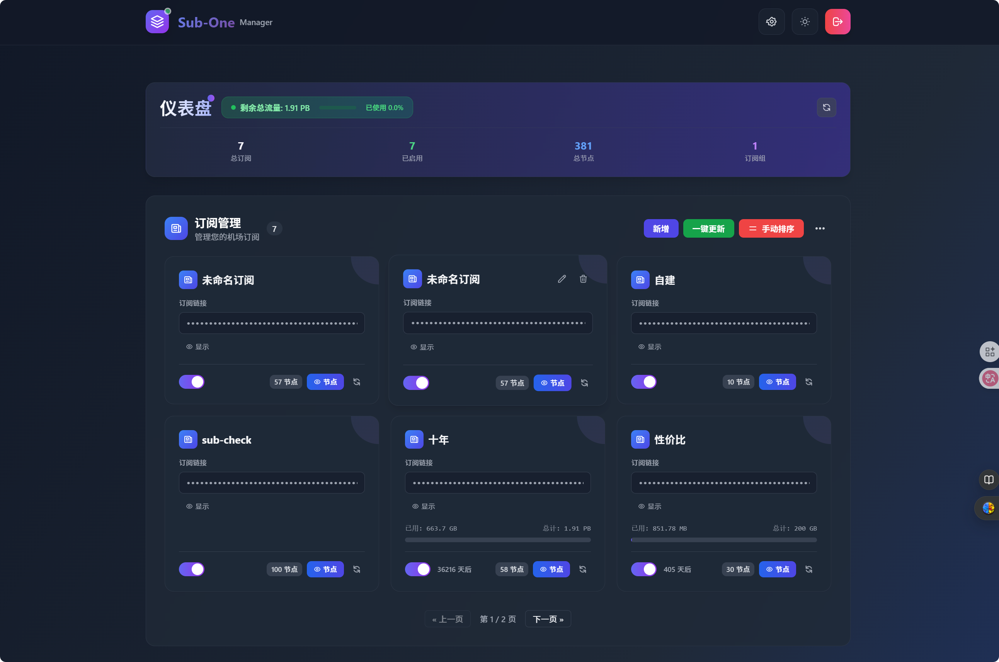

# Sub-One Manager

> 🚀 基于 Vue.js 3 的现代化订阅管理工具，专为 Cloudflare Pages 设计

[](https://vuejs.org/)
[](https://tailwindcss.com/)
[](https://pages.cloudflare.com/)
[](https://www.typescriptlang.org/)
[](LICENSE)

## 📖 项目简介

**Sub-One Manager** 是一款专为网络订阅管理而设计的现代化Web应用。它基于Vue.js 3构建，采用最新的前端技术栈，为用户提供直观、高效的订阅管理体验。

### 🎯 项目特色
- **🚀 现代化架构**: 基于Vue.js 3 Composition API，响应式设计
- **🎨 精美界面**: 采用Tailwind CSS，支持深色主题
- **📱 全平台适配**: 完美支持桌面、平板、手机等设备
- **⚡ 高性能**: 基于Cloudflare Workers，全球CDN加速
- **🔒 安全可靠**: 完善的权限控制和数据加密
- **🏷️ 标签页布局**: 顶部标签页导航，功能模块清晰分离

## ✨ 核心功能

### 🏷️ 标签页导航系统
- **清晰分类**: 四个主要功能模块，独立的导航标签页区域
- **订阅管理**: 管理机场订阅，查看节点信息和流量状态
- **订阅组**: 组合管理节点，创建个性化配置
- **链接生成**: 生成各种格式的订阅链接
- **手动节点**: 管理单个节点链接，支持批量操作
- **无缝切换**: 标签页间快速切换，保持所有功能完整
- **模块化设计**: 导航标签页独立组件，便于维护和扩展


### 📋 订阅管理
- **多订阅支持**: 支持多个机场订阅同时管理，统一界面操作
- **自动解析**: 智能解析订阅链接，自动获取节点信息
- **流量监控**: 实时显示流量使用情况和到期时间
- **智能分页**: 2行3列布局，支持分页浏览，操作更流畅

### 👥 订阅组管理
- **组合订阅**: 将多个订阅组合成订阅组，灵活配置
- **节点筛选**: 支持按地区、协议等条件筛选节点
- **自定义规则**: 包含/排除规则配置，满足个性化需求
- **分页浏览**: 支持订阅组分页显示，管理大量数据

### 🔗 链接生成
- **多格式支持**: 支持Clash、Surge、Loon、Sing-Box、Base64等多种格式
- **自适应格式**: 根据客户端自动选择最佳输出格式
- **Token管理**: 支持固定Token和自动Token，灵活配置
- **链接加密**: 敏感信息自动隐藏，保护隐私安全

### ⚙️ 手动节点管理
- **批量导入**: 支持批量导入节点链接，提高效率
- **智能去重**: 自动去除重复节点，保持数据整洁
- **地区排序**: 按地区自动排序节点，便于查找
- **搜索功能**: 快速搜索特定节点，支持模糊匹配


## 🛠️ 技术架构

### 前端技术栈
- **Vue.js 3.4+**: 采用Composition API，响应式设计
- **TypeScript 5.9+**: 类型安全，提高代码质量
- **Tailwind CSS 3.4+**: 现代化UI设计系统
- **Pinia 3.0+**: 状态管理，响应式数据流
- **Vue Router**: 单页应用路由管理
- **Vite 5.2+**: 快速构建工具，开发体验优秀

### 后端特性
- **Cloudflare Workers**: 边缘计算，全球部署
- **KV存储**: 高性能键值存储，数据持久化
- **自动部署**: 一键部署到Cloudflare Pages
- **CDN加速**: 全球CDN网络，访问速度快


### 🖼️ 界面预览

#### 🔐 登录界面

*简洁的登录界面，支持管理员密码验证*

#### 📋 订阅管理

*订阅管理界面，支持2行3列布局，包含分页控制*

#### 🔗 订阅链接生成

*订阅链接生成面板，支持多种格式和自动Token提示*

#### ⚙️ 手动节点管理

*手动节点管理界面，支持4列网格布局和搜索功能*

## 📱 使用指南

### 添加订阅
1. 点击"新增"按钮
2. 输入订阅名称（可选，自动获取）
3. 输入订阅链接（http/https格式）
4. 配置包含/排除规则（可选）
5. 保存订阅

### 创建订阅组
1. 点击"新增"按钮
2. 输入订阅组名称
3. 选择要包含的订阅和手动节点
4. 配置自定义ID（可选）
5. 设置到期时间（可选）

### 生成订阅链接
1. 选择订阅内容（默认或订阅组）
2. 选择输出格式
3. 点击"显示"查看链接
4. 点击"复制"复制到剪贴板

### 管理手动节点
1. 点击"新增"添加单个节点
2. 或使用"批量导入"添加多个节点
3. 使用搜索功能快速查找节点
4. 使用"一键排序"按地区排序
5. 使用"一键去重"去除重复节点

## 🛠️ 开发指南

### 项目结构
```
Sub-One/
├── 📁 functions/                    # Cloudflare Pages Functions
│   └── [[path]].js                  # 后端API处理函数
├── 📁 src/                          # 源代码目录
│   ├── 📁 assets/                   # 静态资源
│   │   └── main.css                 # 主样式文件
│   ├── 📁 components/               # Vue组件
│   │   ├── 📁 cards/                # 卡片组件
│   │   │   ├── Card.vue             # 通用卡片组件
│   │   │   ├── ManualNodeCard.vue   # 手动节点卡片
│   │   │   ├── ProfileCard.vue      # 订阅组卡片
│   │   │   └── SkeletonCard.vue     # 骨架屏卡片
│   │   ├── 📁 forms/                # 表单组件
│   │   │   └── Login.vue            # 登录表单
│   │   ├── 📁 layout/               # 布局组件
│   │   │   ├── Header.vue           # 页面头部
│   │   │   ├── Footer.vue           # 页面底部
│   │   │   └── NavigationTabs.vue   # 导航标签
│   │   ├── 📁 modals/               # 模态框组件
│   │   │   ├── BulkImportModal.vue  # 批量导入模态框
│   │   │   ├── HelpModal.vue        # 帮助模态框
│   │   │   ├── NodeDetailsModal.vue # 节点详情模态框
│   │   │   ├── ProfileModal.vue     # 订阅组模态框
│   │   │   ├── SettingsModal.vue    # 设置模态框
│   │   │   └── SubscriptionImportModal.vue # 订阅导入模态框
│   │   ├── 📁 sections/             # 页面区域组件
│   │   │   ├── GeneratorSection.vue # 链接生成器区域
│   │   │   ├── ManualNodeSection.vue # 手动节点管理区域
│   │   │   ├── ProfileSection.vue   # 订阅组管理区域
│   │   │   └── SubscriptionSection.vue # 订阅管理区域
│   │   ├── Dashboard.vue            # 主仪表板组件
│   │   ├── DashboardSkeleton.vue    # 仪表板骨架屏
│   │   ├── ManualNodeList.vue       # 手动节点列表
│   │   ├── Modal.vue                # 基础模态框
│   │   ├── ModalManager.vue         # 模态框管理器
│   │   ├── SubscriptionLinkGenerator.vue # 订阅链接生成器
│   │   └── Toast.vue                # 消息提示组件
│   ├── 📁 composables/              # 组合式函数
│   │   ├── useManualNodes.js        # 手动节点管理逻辑
│   │   └── useSubscriptions.js      # 订阅管理逻辑
│   ├── 📁 lib/                      # 工具库
│   │   ├── api.js                   # API接口函数
│   │   ├── constants.js             # 常量定义
│   │   ├── helpers.js               # 辅助函数
│   │   ├── subscriptionParser.js    # 订阅解析器
│   │   └── utils.js                 # 通用工具函数
│   ├── 📁 stores/                   # Pinia状态管理
│   │   ├── session.js               # 会话状态
│   │   ├── theme.js                 # 主题状态
│   │   ├── toast.js                 # 消息提示状态
│   │   └── ui.js                    # UI状态
│   ├── App.vue                      # 根组件
│   └── main.js                      # 应用入口
├── 📄 配置文件
│   ├── package.json                 # 项目依赖配置
│   ├── vite.config.js               # Vite构建配置
│   ├── tailwind.config.cjs          # Tailwind CSS配置
│   ├── tsconfig.json                # TypeScript配置
│   └── wrangler.toml                # Cloudflare Workers配置
└── README.md                        # 项目说明文档
```

> 📋 详细的项目结构说明请查看 [PROJECT_STRUCTURE.md](./PROJECT_STRUCTURE.md)

### 开发环境配置

### 核心组件
- **Dashboard.vue**: 主界面，已重构为模块化架构，职责更加清晰
- **SubscriptionSection.vue**: 订阅管理区域组件，负责订阅的显示、操作和分页
- **ProfileSection.vue**: 订阅组管理区域组件，负责订阅组的显示、操作和分页
- **ManualNodeSection.vue**: 手动节点管理区域组件，负责节点的显示、搜索、排序等
- **GeneratorSection.vue**: 订阅链接生成区域组件，负责链接生成功能
- **ModalManager.vue**: 模态框管理组件，统一管理所有模态框的显示和隐藏
- **NavigationTabs.vue**: 独立的导航标签页组件，提供清晰的模块分类
- **Header.vue**: 顶部导航栏，包含Logo和操作按钮
- **Card.vue**: 订阅卡片组件
- **ProfileCard.vue**: 订阅组卡片组件

### 状态管理
- **useSessionStore**: 会话状态管理，包含登录、登出、数据刷新等功能
- **useToastStore**: 消息提示管理，支持消息队列和多种类型
- **useThemeStore**: 主题管理，支持深色模式和系统主题检测
- **useUIStore**: UI状态管理，包含模态框、布局等状态
- **useSubscriptions**: 订阅数据管理，提供增删改查、分页、更新等功能
- **useManualNodes**: 手动节点管理，提供搜索、排序、去重等功能

### 工具函数
- **constants.js**: 应用常量定义，包含分页配置、地区映射、正则表达式等
- **helpers.js**: 辅助工具函数，包含防抖、节流、深拷贝、格式化等通用功能
- **utils.js**: 节点链接解析工具，包含名称提取、主机端口提取等功能
- **api.js**: API接口函数，提供与后端服务的数据交互功能

## 🔒 安全特性

- **Token验证**: 严格的Token验证机制
- **数据加密**: 敏感数据加密存储
- **访问控制**: 基于Token的访问控制
- **错误处理**: 完善的错误边界处理
- **输入验证**: 严格的用户输入验证

## 🚀 性能优化

### 代码架构优化
- **模块化设计**: 将大型组件拆分为功能单一的小组件，提高可维护性
- **组件复用**: 通过ModalManager等组件实现代码复用，减少重复代码
- **状态管理优化**: 使用Pinia进行集中状态管理，提高数据流清晰度
- **Composables模式**: 将业务逻辑抽离为可复用的组合式函数

### 性能优化
- **代码分割**: 按需加载，减少初始包大小
- **懒加载**: 图片和组件懒加载
- **虚拟滚动**: 大量数据的高效渲染
- **缓存策略**: 智能缓存，提升访问速度
- **CDN加速**: 全球CDN网络，就近访问
- **防抖节流**: 对搜索、输入等操作进行防抖处理，减少不必要的计算
- **常量提取**: 将硬编码值提取为常量，便于维护和优化

### 代码质量
- **TypeScript支持**: 提供类型检查和更好的开发体验
- **统一注释规范**: 使用JSDoc格式的注释，提高代码可读性
- **错误处理**: 完善的错误边界处理和用户友好的错误提示
- **代码风格统一**: 遵循Vue.js最佳实践和ESLint规范


## 🚀 快速开始

### 环境要求
- **Node.js**: 16.0+ 版本
- **包管理器**: npm 或 yarn
- **浏览器**: 支持ES6+的现代浏览器

### 本地开发
```bash
# 克隆项目
git clone <repository-url>
cd Sub-One

# 安装依赖
npm install

# 启动开发服务器
npm run dev

# 构建生产版本
npm run build

# 预览构建结果
npm run preview
```

### 🌐 Cloudflare Pages 部署

本项目专为Cloudflare Pages设计，支持一键部署。

#### 步骤 1: Fork 项目
1. 点击右上角的 "Fork" 按钮
2. 选择你的GitHub账户作为目标

#### 步骤 2: 创建Cloudflare Pages项目
1. 登录 [Cloudflare控制台](https://dash.cloudflare.com/)
2. 进入 `Workers & Pages` → `Pages`
3. 点击 "创建应用程序" → "连接到Git"
4. 选择你刚刚Fork的Sub-One仓库
5. 配置构建设置：
   - **框架预设**: `Vue`
   - **构建命令**: `npm run build`
   - **构建输出目录**: `dist`
   - **根目录**: `/` (留空)

#### 步骤 3: 配置环境变量
在项目设置中添加以下**生产环境**变量：

| 变量名 | 值 | 说明 |
|--------|----|----|
| `ADMIN_PASSWORD` | 你的管理员密码 | 用于登录管理界面，建议使用强密码 |

#### 步骤 4: 绑定KV命名空间
1. 在项目设置中进入 "函数" → "KV命名空间绑定"
2. 点击 "添加绑定"
3. 配置绑定：
   - **变量名称**: `SUB_ONE_KV`
   - **KV命名空间**: 选择或创建新的KV命名空间

#### 步骤 5: 部署项目
1. 回到 "部署" 选项卡
2. 点击 "重新部署" 按钮
3. 等待部署完成

#### 步骤 6: 访问应用
部署完成后，你会获得一个Cloudflare Pages域名：
```
https://your-project-name.pages.dev
```

### 🔧 自定义域名（可选）
1. 在项目设置中进入 "自定义域"
2. 添加你的域名
3. 按照提示配置DNS记录

## 🛠️ 故障排除

### 常见问题
1. **构建失败**
   - 检查Node.js版本是否为16.0+
   - 确认`package.json`中的依赖版本正确
   - 清除`node_modules`并重新安装

2. **KV绑定错误**
   - 确认KV命名空间已创建
   - 检查变量名称是否为`SUB_ONE_KV`
   - 重新部署项目

3. **环境变量未生效**
   - 确认变量已添加到生产环境
   - 重新部署项目
   - 检查变量名拼写是否正确

4. **登录失败**
   - 检查`ADMIN_PASSWORD`是否正确设置
   - 确认环境变量已生效
   - 清除浏览器缓存

### 调试技巧
- 查看Cloudflare Pages的构建日志
- 检查浏览器控制台的错误信息
- 使用Cloudflare的实时日志功能
- 使用Vue DevTools进行前端调试

## 🔒 安全建议

1. **强密码**: 使用强密码作为管理员密码
2. **定期更新**: 定期更新依赖包和项目版本
3. **备份数据**: 定期备份KV中的数据
4. **监控访问**: 关注异常访问日志
5. **HTTPS**: 确保使用HTTPS协议访问

## 🙏 致谢

### 项目起源
本项目是基于 [CM大佬的CF-Workers-SUB项目](https://github.com/cmliu/CF-Workers-SUB) ，感谢CM大佬提供的优秀基础架构。

### 二次开发
本项目是对 [imzyb/MiSub](https://github.com/imzyb/MiSub) 的二次修改版本，感谢原项目作者 [imzyb](https://github.com/imzyb) 及其贡献者们的优秀工作！

### 技术栈致谢
- Vue.js 团队提供的优秀框架
- Tailwind CSS 提供的现代化样式解决方案
- Cloudflare 提供的 Workers 平台
- 所有贡献者的辛勤付出

## 📄 许可证

本项目采用 MIT 许可证 - 查看 [LICENSE](LICENSE) 文件了解详情

---

**Sub-One Manager** - 让订阅管理变得简单高效 🚀

*如果你觉得这个项目对你有帮助，请给我们一个 ⭐ Star！*
